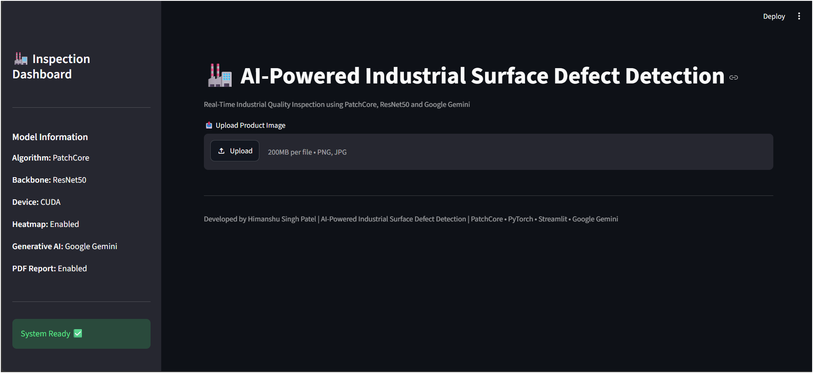
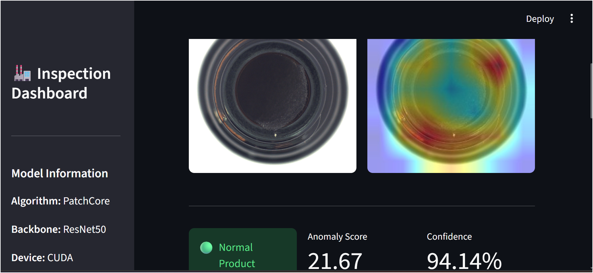
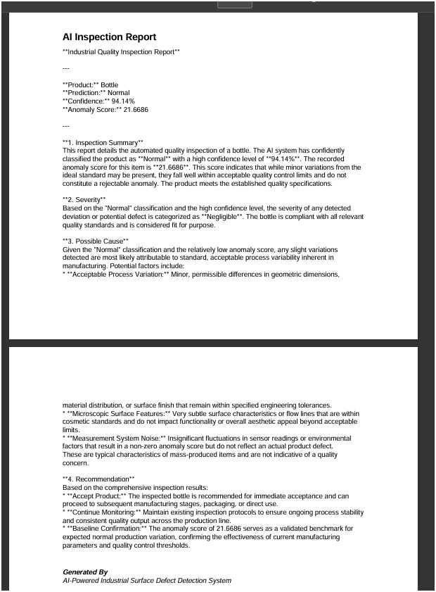
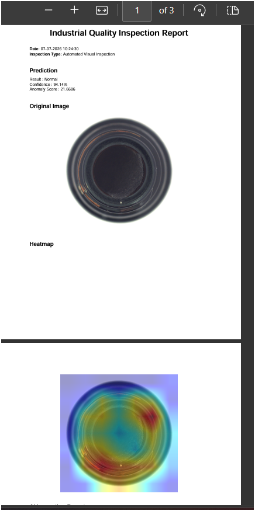

# 🏭 VisionInspect AI

## AI-Powered Industrial Surface Defect Detection & Intelligent Inspection Assistant

VisionInspect AI is an intelligent industrial quality inspection system that detects surface defects using a custom PatchCore-inspired anomaly detection pipeline with ResNet50 feature extraction. The application provides anomaly visualization through heatmaps, AI-generated inspection reports using Google Gemini, downloadable PDF reports, and an interactive Streamlit dashboard for real-time quality inspection.

---

# 🚀 Features

- 🔍 Surface Defect Detection using PatchCore-inspired anomaly detection
- 🧠 Deep Feature Extraction using ResNet50
- 🔥 Heatmap Visualization for anomaly localization
- 🤖 AI-generated Inspection Reports using Google Gemini
- 📄 Downloadable PDF Inspection Reports
- 📊 Confidence Score & Anomaly Score
- 🖥 Interactive Streamlit Dashboard
- ⚡ CUDA (GPU) Support
- 📁 Modular Project Structure

---

# 🛠 Tech Stack

| Category | Technology |
|----------|------------|
| Language | Python |
| Deep Learning | PyTorch |
| Backbone | ResNet50 |
| Anomaly Detection | PatchCore-inspired Method |
| Machine Learning | Scikit-learn |
| Computer Vision | OpenCV |
| Dashboard | Streamlit |
| Generative AI | Google Gemini |
| PDF Generation | ReportLab |
| Image Processing | Pillow |
| Numerical Computing | NumPy |

---

# 📂 Project Structure

```text
VisionInspect-AI/
│
├── app.py
├── train.py
├── inference.py
├── feature_extractor.py
├── patchcore.py
├── heatmap.py
├── ai_report.py
├── pdf_report.py
├── test_gemini.py
│
├── models/
├── outputs/
├── screenshots/
│
├── requirements.txt
├── README.md
├── .gitignore
└── .env
```

---

# ⚙️ System Requirements

- Python 3.11+
- Windows / Linux / macOS
- CUDA-compatible GPU (Optional)
- Google Gemini API Key

---

# 🚀 Installation

## 1️⃣ Clone Repository

```bash
git clone https://github.com/<YOUR_GITHUB_USERNAME>/VisionInspect-AI.git
cd VisionInspect-AI
```

---

## 2️⃣ Create Virtual Environment (Recommended)

```bash
python -m venv venv
```

Activate it:

### Windows

```powershell
.\venv\Scripts\Activate.ps1
```

### Linux / macOS

```bash
source venv/bin/activate
```

---

## 3️⃣ Install Dependencies

```bash
pip install -r requirements.txt
```

---

## 4️⃣ Configure Google Gemini API

Create a `.env` file in the project root.

Add:

```text
GEMINI_API_KEY=YOUR_API_KEY
```

Replace `YOUR_API_KEY` with your Google Gemini API key.

---

# ▶️ Running the Application

Run the Streamlit application:

```powershell
python -m streamlit run app.py
```

Open:

```
http://localhost:8501
```

---

# 🧠 Training

To rebuild the Memory Bank and Threshold:

```powershell
python train.py
```

---

# 🔍 Test Inference

```powershell
python inference.py
```

---

# 📄 Workflow

1. Upload an industrial product image.
2. Extract deep features using ResNet50.
3. Compare extracted features with the PatchCore Memory Bank.
4. Compute the anomaly score.
5. Generate an anomaly heatmap.
6. Produce an AI inspection report using Google Gemini.
7. Download a professional PDF inspection report.

---

# 📷 Screenshots

## Dashboard



---

## Prediction & Heatmap



---

## AI Inspection Report



---

## PDF Inspection Report



---

# 📊 Project Pipeline

```text
Product Image
      │
      ▼
ResNet50 Feature Extraction
      │
      ▼
PatchCore Memory Bank
      │
      ▼
Anomaly Detection
      │
      ▼
Heatmap Generation
      │
      ▼
Google Gemini AI Report
      │
      ▼
PDF Inspection Report
```

---

# ⚠️ Common Issues

## Streamlit Not Found

Run:

```powershell
python -m streamlit run app.py
```

instead of:

```powershell
streamlit run app.py
```

---

## Wrong Python Environment

Verify Python:

```powershell
where python
```

Ensure it points to your active virtual environment.

---

## Gemini API Quota Exceeded

If the free API quota is exhausted:

- Wait until the quota resets.
- Generate the report again.
- The application automatically shows a fallback report until the API becomes available.

---

# 🔮 Future Enhancements

- Multi-product support
- Batch image inspection
- Real-time camera inspection
- Database integration
- Inspection history dashboard
- Cloud deployment
- True PatchCore anomaly localization

---

# 👨‍💻 Author

**Himanshu Singh Patel**

VisionInspect AI

AI-Powered Industrial Surface Defect Detection & Intelligent Inspection Assistant

---

# ⭐ If you like this project

Please consider giving it a ⭐ on GitHub.